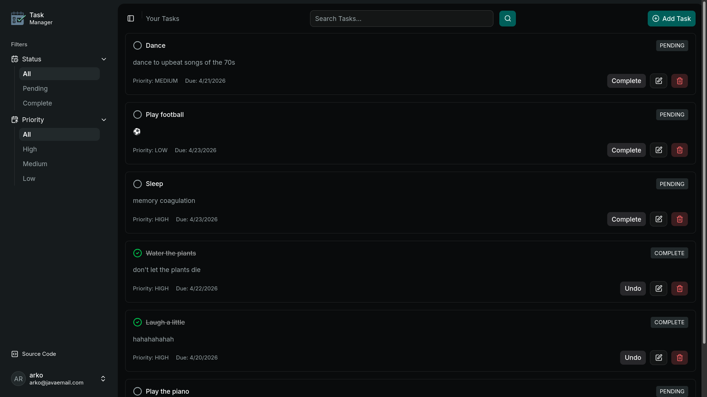

# Task Manager Frontend

A simple task management web app built with React, TypeScript, Vite.
This client is for my backend API: [Task Manager API](https://github.com/arkaman/task-manager-api)

Supports authentication, task CRUD operations, filtering, and search.

---

## 🚀 Features

* User authentication (login/signup)
* Access + refresh token handling
* Create, update, delete tasks
* Filter by status and priority
* Search tasks
* Responsive UI

---

## 🛠️ Tech Stack

* React + TypeScript
* Vite
* Tailwind CSS
* [Shadcn UI](https://ui.shadcn.com/)
* REST API integration

---

## ⚙️ Setup

1. Clone the repo

```bash
git clone https://github.com/arkaman/task-manager-client.git
cd task-manager-client
```

2. Install dependencies

```bash
npm install
```

3. Create `.env` file

```env
VITE_API_BASE_URL=http://localhost:8080
```

4. Run the app

```bash
npm run dev
```

---

## 📦 Build

```bash
npm run build
```

## 🖼️ Screenshot


